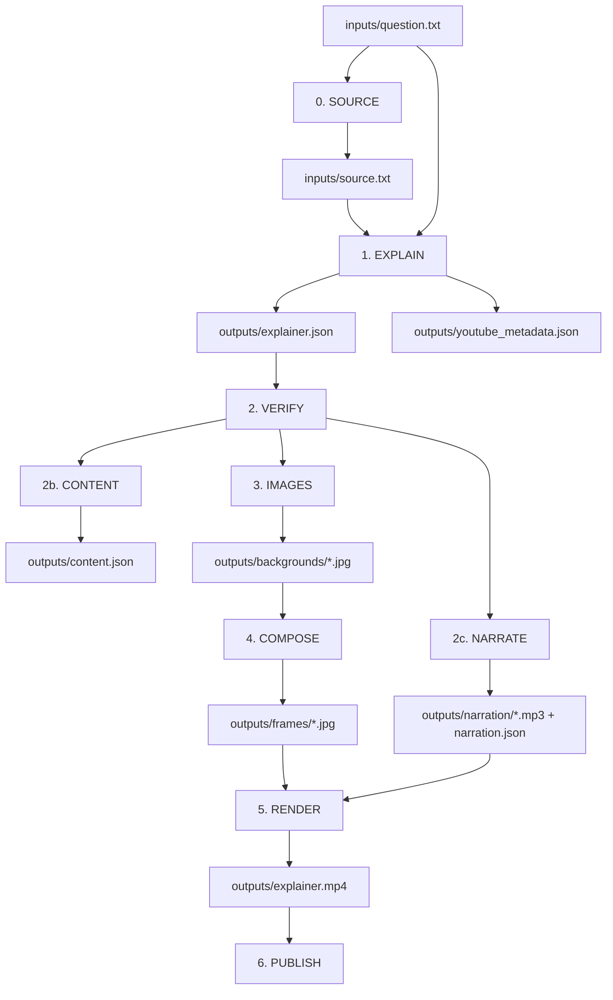

# Know the Big Picture — Product and Technical Design

This document is the canonical product, editorial, data-contract, and runtime
design. Values described as package defaults come from `settings.py`. The
example job template contains explicit overrides and is called out separately.

## 1. Product

Know the Big Picture is an automated everyday-curiosity video engine. It gives
ordinary people the smallest satisfying answer, regardless of age, profession,
or English fluency.

**Mission:** The world, explained.

**Brand promise:** The internet explains what. We explain why and how.

### Principles

- Start with the viewer's exact question.
- Optimize for curiosity rather than expertise.
- Be simple without becoming simplistic or childish.
- Stop when the viewer can understand and retell the main idea.
- Put one major idea on each slide.
- Ground factual claims and narration in the reusable source packet.
- Use visuals to teach, not merely decorate.
- Write narration for the ear and visible copy for the eye.
- Keep expensive stages cached and runs resumable.
- Treat food, fitness, travel, home, nature, and similar areas as editorial
  series, not separate technical pipelines.

## 2. Editorial model

### Content formats

| Format | Story shape |
|---|---|
| `why` | immediate answer → cause → recognizable result → payoff |
| `how` | starting point → major actions → transformation → result |
| `types` | exact title → one distinct variety per slide |
| `comparison` | shared ground → matched practical differences → fit |
| `what_is_it` | plain description → function → example → relevance |
| `myth_vs_fact` | claim → qualified verdict → correction → takeaway |

Types contains the requested 4–12 item slides plus the opening. Its default item
count is 5. Other formats use 5–6 slides.

Every video begins with one `question` slide. Remaining slides use only the
roles useful to that explanation:

| Role | Purpose |
|---|---|
| `question` | Exact author input; mandatory and first |
| `definition` | What the subject is |
| `purpose` | Why it exists or matters |
| `mechanism` | How a process or cause works |
| `component` | One important part |
| `example` | A concrete case |
| `comparison` | An accurate analogy or contrast |
| `context` | Relevant who, when, or background |
| `misconception` | Correction of a likely misunderstanding |
| `surprising_fact` | A memorable supported closing insight |
| `type` | One distinct variety in a Types collection |

In Types, every slide after the opening has role `type`. Other formats select
roles as needed rather than filling a fixed template.

## 3. Pipeline



- **Source:** reuse `source.txt` or generate it from the question.
- **Explain:** create the slide model, narration script, and YouTube metadata.
- **Verify:** enforce structure, word limits, source support, and image prompts.
- **Content:** write the platform-neutral `content.json`.
- **Narrate:** synthesize and cache one speech clip per slide and the outro.
- **Images:** create one 9:16 teaching background per content slide.
- **Compose:** place the visible copy and branding over each background.
- **Render:** time slides, mix narration and music, add the outro, and encode MP4.
- **Publish:** optionally upload to YouTube and Instagram.

`--dry-run` creates a local mock source and mocks paid content, narration, and
image calls while still exercising verification, composition, timing, and
rendering. `--lite` stops after verified content and does not narrate, generate
images, render, or publish.

## 4. Job contract

```text
jobs/<numeric-id>/
  job.json
  inputs/
    question.txt
    source.txt
  outputs/
    explainer.json
    content.json
    youtube_metadata.json
    narration/
      narration.json
      <slide-id>.mp3
      outro.mp3
      compressed/
    backgrounds/<slide-id>.jpg
    frames/<slide-id>.jpg
    render_plan.json
    explainer.mp4
    youtube_upload.json
    instagram_upload.json
  logs/
  status.json
```

`question.txt` is the primary author input. `source.txt` is optional; a real run
generates and caches it when absent. A dry run creates an explicitly synthetic
placeholder. A numeric ID must never be reused for a different question.

## 5. Canonical explainer schema

`explainer.json` contains facts, presentation order, and spoken copy, but no
timing:

```json
{
  "schema_version": 1,
  "explainer": {
    "id": "4",
    "question": "How does GPS know your location?",
    "question_source": "author",
    "subject": "GPS positioning",
    "subject_source": "llm",
    "audience": "general_non_technical_audience",
    "content_format": "how",
    "item_count": null,
    "summary": "GPS calculates position from satellite signal travel time."
  },
  "slides": [
    {
      "id": 1,
      "role": "question",
      "heading": "How does GPS know your location?",
      "explanation": "Your phone compares signals from clocks orbiting Earth.",
      "narration": "Your phone finds you using clocks moving through space.",
      "source_quotes": ["verbatim support from source.txt"],
      "image_prompt": "A phone beneath several satellites at night",
      "priority": 1
    }
  ]
}
```

Slide IDs start at 1. `priority` controls trimming: 1 is essential, 2 is useful,
and 3 is safest to remove. When the model omits narration, the parser falls back
to the heading and explanation.

## 6. Generation providers

The source packet and explainer share the `parse` configuration:

- Package default provider: `gemini`
- Package default Gemini model: `gemini-3.6-flash`
- Explicit OpenAI alternative: `gpt-5-mini`
- Automatic cross-provider fallback: none
- API keys: `GEMINI_API_KEY` (or `GOOGLE_API_KEY`) and `OPENAI_API_KEY`
- Model environment overrides: `GEMINI_MODEL` and `OPENAI_MODEL`

Gemini 3.x requests omit temperature because those models manage sampling
internally. Earlier Gemini models receive the configured temperature.

Image generation has an independent provider:

- Package default: OpenAI `gpt-image-1-mini`, quality `low`
- Gemini alternative: `gemini-3.1-flash-image-preview`, aspect ratio `9:16`
- Automatic cross-provider fallback: none
- Model override: `GEMINI_IMAGE_MODEL`

The example in `job_templates/explainer/job.json` deliberately overrides the
package image defaults to Gemini at high quality. Queue-created jobs do not copy
those template overrides; they use package defaults unless `create_job.py` is
extended or their `job.json` is edited.

## 7. Prompt and verification contracts

The explainer prompt must:

- preserve the exact question as the first heading;
- use the selected format's story shape;
- keep one distinct fact or idea per slide;
- use ordinary, conversational language;
- provide source quotations supporting visible and spoken claims;
- provide one simple instructional image prompt per slide;
- create one short narration sentence per slide;
- make narration flow as a continuous spoken story;
- use a short, honest opening hook;
- return JSON only.

Narration normally uses 8–16 spoken words per slide and aims for roughly 90–115
words across the complete script. It does not simply read the visible heading.

Verification mechanically checks:

- format-specific slide count;
- exactly one question role, first;
- normalized match between the author question and first heading;
- sequential IDs and unique headings;
- heading and explanation word limits;
- non-empty image prompts;
- source quotations grounded in `source.txt`.

Direct and normalized quotation matches are accepted. Ellipsis-separated
fragments are accepted only when every non-empty fragment exists in the source.
`parse.on_verification_fail` controls whether failure stops the job.

## 8. Visual system

The default vibe is `educational_documentary`. Background prompts request one
obvious subject or action, few objects, clean composition, natural materials,
controlled light, and calm central space.

The prompt explicitly prohibits words, letters, numbers, pseudo-text, labels,
logos, brands, signs, packaging text, screens, documents, maps, charts,
watermarks, diagrams, arrows, and multi-panel layouts. The generated background
contains no intentional writing; the application adds the real slide text
during composition.

Image generation policy:

1. Reuse a cached background when present.
2. Make one normal provider request when absent.
3. Make one replacement request only if the response is technically unusable:
   missing, unreadable, too small, effectively black/white, or without detail.
4. Use a local neutral background if the replacement is also unusable or a
   policy refusal occurs.
5. Do not regenerate merely because the creative quality is disappointing.
6. Do not retry provider, network, or rate-limit failures.

Composition uses a black panel with high-contrast visible copy and the channel
signature. Role labels are hidden by default. A branded outro card includes the
channel handle and like/subscribe call to action.

## 9. Narration and audio

Narration is enabled by default and uses Edge TTS:

- Engine: `edge`
- Package-default voice: `en-US-EmmaNeural`
- Package-default rate: `+10%`
- Music volume beneath speech: `0.10`
- Failure behavior: fall back to music-only

The example job template overrides the voice to `en-US-AndrewNeural` at `+0%`.
Changing the voice or rate changes the narration cache hash and regenerates the
affected clips. The outro narration is configured separately and is synthesized
only when the outro is enabled and its text is non-empty.

If TTS fails and `on_tts_fail` is `music`, rendering continues with silent slides
and background music. `fail_job` makes narration failure fatal.

## 10. Timing and rendering

Without narration, timing derives from visible heading plus explanation word
count. Each format has its own reading profile; the title uses a separate
profile. Optional slides are removed when necessary and silent durations scale
into the configured range.

With narration, measured speech duration drives the plan:

1. Remove optional slides if needed.
2. Reduce narration lead-in and tail padding.
3. Pitch-preservingly compress speech up to `1.15x`.
4. Allow a small overflow rather than clip a spoken sentence.

The narrated outro grows to fit its call to action. The package duration defaults
are 30–50 seconds; `job.json` may override them. The example template currently
uses 30–75 seconds.

## 11. Publishing

The explanation call creates an evergreen YouTube title, description, and tags.
The default YouTube category is Education (`27`).

- YouTube is disabled in the general job template and private by default.
- Queue-created jobs always enable YouTube.
- `youtube_public=TRUE` makes a queued Short public.
- A false or blank `youtube_public` uploads it privately.
- Instagram is disabled by default and remains queue opt-in.
- Instagram `container_only` creates and validates a container without publishing
  it live; `live` is explicit.

Publishing is also gated by command-line selection. `--no-publish` always wins.

## 12. Configuration

| Section | Main controls |
|---|---|
| `explainer` | question, subject, audience, format, Types item count |
| `parse` | provider, models, temperature, slide range, word limits, verification behavior |
| `images` | provider, models, size/aspect ratio, quality, vibe |
| `compose` | backdrop, blur, plate opacity, explanation and role visibility |
| `video` | duration, motion, music, outro, voice-over |
| `video.voiceover` | enabled, engine, voice, rate, music volume, failure behavior, outro narration |
| `youtube` | enablement, privacy, upload metadata |
| `instagram` | enablement, mode, caption, URL |

There is intentionally no subject-category field or category-specific pipeline.

## 13. Operations

There are two GitHub Actions workflows:

- `run-knowthebigpicture.yml`: manually submitted job ID, question, format,
  execution mode, and publishing choices.
- `produce-next-video.yml`: manual or twice-daily Google Sheets queue worker.

The queue workflow exports both current provider credentials. The older manual
workflow still exports only `OPENAI_API_KEY`; it needs `GEMINI_API_KEY` added
before its real/lite path can use the package's Gemini text default.

The queue runs at `02:27` and `14:27` UTC: 9:27 AM/PM EST, 10:27 AM/PM EDT,
6:27 AM/PM PST, or 7:27 AM/PM PDT. It processes at most one valid pending row
and uses concurrency to prevent overlapping claimers.

Remote assets and jobs use the `kbpdrive:` rclone root in the checked-in
workflows:

```text
kbpdrive:assets
kbpdrive:jobs/<id>
```

The queue's Sheet state is the production ledger; Drive holds assets and job
artifacts. See `GOOGLE_SHEETS_QUEUE.md` for the exact columns and setup.
