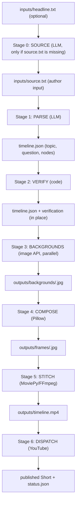

# KnowTheTimeline — Technical Design

This document is the single source of truth for how KnowTheTimeline works. It
describes the product, the data model, every processing stage, and every
configurable knob. It is a living document: any change to the design is reflected
here.

It is intentionally written at a design level, not an implementation level. It
describes *what* the system does and *why*, and the contracts between stages —
not specific code.

---

## 1. What KnowTheTimeline Is

KnowTheTimeline is an automated short-form vertical video engine. It converts a
single raw text document about a news event into a 9:16 video that reconstructs
the event as an objective, chronological timeline answering one question:
**"How did we get here?"**

The product exists to counter headline fatigue. It does not break news, editorialize,
or debate. It states plain, dated, sourced facts in sequence.

### Core principles

- **Objective only.** No opinion, no loaded adjectives, no speculation. Only
plain, sourced facts.
- **Minimal author effort.** The author's only task is to paste raw text into one
file. Everything else is the system's job.
- **Sequence is everything.** The product is fundamentally an ordered set of
dated events. Identity and order are first-class.
- **Truth is verified, not trusted.** Because publishing is fully automated,
every fact is mechanically checked against the source before a video is built.
- **Timing is derived, not authored.** The story defines the facts; the system
computes presentation timing separately.
- **Configuration over code.** Behavior is driven by a small set of documented
knobs with sensible global defaults.
- **Resumable and cheap.** Expensive steps cache their output; reruns skip work
that already exists.

---


## 2. Pipeline Overview

The system is a linear pipeline. Each stage consumes the previous stage's output
and adds files to the job's `outputs/` folder.




### Cost profile

- **P**aid (external API): Stage 0 (optional; one LLM call to expand a headline
into a source, only when `source.txt` is absent), Stage 1 (one LLM call producing
the timeline AND the YouTube metadata), Stage 3 (image generation), Stage 6
(YouTube upload only, no separate metadata LLM call).
- **Free (local only):** Stage 2 (verification), Stage 4 (compositing), Stage 5
(video stitching).

Caching means a rerun to fix wording or timing re-pays for nothing. YouTube
metadata is produced inside the Stage 1 call, because the model already holds the
full source and the generated timeline as context — cheaper and better grounded
than a separate call.

---


## 3. Job Folder Contract

Every video is a self-contained job folder. All paths are relative to the job
folder.

```text
jobs/<id>/
  inputs/
    source.txt          # author input (required unless headline.txt is provided)
    headline.txt        # optional; if source.txt is absent, Stage 0 generates it
  job.json              # optional; overrides only
  outputs/
    timeline.json       # Stage 1 output; Stage 2 adds verification in place
    render_plan.json     # Stage 5 derived timing (regenerable)
    backgrounds/<id>.jpg # Stage 3 output, one per node
    frames/<id>.jpg      # Stage 4 output, one per node
    timeline.mp4         # Stage 5 output
    youtube_metadata.json# produced in the Stage 1 call
    youtube_upload.json  # Stage 6 output (if publishing)
  logs/                 # timestamped run logs
  status.json           # final state: success/failure + failing stage
```


### Identifiers

- **Job id and node id are always numeric.**
- The job id equals the job folder name (e.g. `jobs/4/` → `id: "4"`).
- Node ids are integers assigned in narrative order (`1` = first slide). The
numeric node id *is* the sequence; there is no separate sequence field.
- Generated files are named by node id (`backgrounds/3.jpg`, `frames/3.jpg`).

---


## 4. The Author Input: `source.txt` (or `headline.txt`)

- The author's entire workload is providing `inputs/source.txt`.
- It contains raw pasted text: a news article, court filing, or press release.
- No formatting is required.
- The system infers everything else (topic, central question, the timeline) from
this text.
- A job with **no** `job.json` **at all** is valid and runs on pure defaults.

### Stage 0 — Source (optional)

- If `source.txt` is **absent** but `inputs/headline.txt` is present, Stage 0
makes a single LLM call that expands the one-line headline into a full
`source.txt`, using `prompts/source_prompt.txt` as the system prompt.
- If `source.txt` **exists**, Stage 0 is skipped entirely — no extra LLM call.
- The generated `source.txt` is written into `inputs/` and cached like any other
input; delete it to regenerate from a changed headline.
- Stage 0 never runs under `--dry-run` (it would require the API); provide
`source.txt` for offline runs.
- The job is invalid only when **both** `source.txt` and `headline.txt` are
missing.

---


## 5. Data Model: `timeline.json`

`timeline.json` is the canonical "truth" artifact. It is timing-free: it holds
facts and order only. Presentation timing is computed separately (Section 10.1).

Stage 1 writes it. Stage 2 adds verification data **in place** (same file).

### 5.1 Structure

```json
{
  "schema_version": 2,
  "story": {
    "id": "4",
    "topic": "Boeing Quality Crisis",
    "topic_source": "llm",
    "central_question": "How did Boeing end up facing criminal charges?",
    "question_source": "llm"
  },
  "nodes": [ ... ]
}
```

- `story.id` — mirrors the job folder id (numeric).
- `topic`, `central_question` — inferred by the LLM from `source.txt`, or taken
from author overrides if provided.
- `topic_source`, `question_source` — provenance, either `"llm"` or `"author"`.


### 5.2 Node fields


| Field                | Applies to                                                    | Meaning                                                                                              |
| -------------------- | ------------------------------------------------------------- | ---------------------------------------------------------------------------------------------------- |
| `id`                 | all                                                           | Integer; narrative order; also the sequence and the file name.                                       |
| `role`               | all                                                           | One of the four roles (Section 6).                                                                   |
| `headline`           | all                                                           | On-screen text. Max 12 words. Clean factual prose. No date inside it.                                |
| `subtitle`           | `starting_point` only                                         | Short bridge line turning the viewer from today to the past. `null` otherwise.                       |
| `event_date`         | `starting_point`, `development`, `resolution`                 | Real event date, ISO (`YYYY`, `YYYY-MM`, or `YYYY-MM-DD`), sortable. `null` for `present_hook`.      |
| `event_date_display` | dated nodes                                                   | Human form (e.g. `"January 2024"`). Shown as the kicker label. `null` when no date.                  |
| `source_quote`       | `present_hook`, `starting_point`, `development`, `resolution` | Verbatim substring of `source.txt` supporting the headline. Used only for verification; never shown. |
| `image_prompt`       | all with a background                                         | Scene description for the image model (no brand words).                                              |
| `priority`           | `development` only                                            | Integer 1 (most essential) to 3 (safe to cut). Drives trim order.                                    |
| `verification`       | all (added by Stage 2)                                        | Per-node check results (Section 8).                                                                  |


### 5.3 Two orderings

- **Narrative order** — how slides appear, carried by `id`/`role` order:
`present_hook → starting_point → development(s) → resolution`.
- **Chronological order** — when events actually happened, carried by
`event_date`.

These differ on purpose: the `present_hook` is today, then the video jumps back
to the origin and moves forward in time. Verification enforces that chronological
order holds across the dated nodes (Section 8).

---


## 6. The Hourglass Model & Roles

KnowTheTimeline structures every story on the **Hourglass (Martini Glass)**
journalistic model, chosen because it is inherently chronological: it opens with
a present-day hook, turns to the past, retells events in order, then loops back
to today. (The Inverted Pyramid was rejected because it is explicitly
anti-chronological; the Narrative Kebab organizes by scale, not time, and is not
used.)

### Roles, in narrative order

1. `present_hook` (exactly 1) — today's core headline; the present-day
  situation that makes viewers care. No date. Also serves as the video's
   opening ("intro").
2. `starting_point` (exactly 1) — the origin event that began the story. It
  is a real dated fact **and** carries a `subtitle` that bridges from today back
   to the past. Never dropped.
3. `development` (many) — the subsequent chronological events, oldest first.
  Each carries a `priority`. These are the only droppable nodes.
4. `resolution` (exactly 1) — how the history connects back to today. Never
  dropped.

Roles serve two purposes only: they **guide the LLM's output shape** and they
**drive per-slide timing/dwell**. They do not control visuals and are not used
for hard structural validation beyond what verification covers.

There is no separate "pivot" slide; the present→past turn lives in the
`starting_point`'s `subtitle`.

---


## 7. Stage 1 — Parse

Converts `source.txt` into `timeline.json`, and in the same call produces the
YouTube publishing metadata.

- **Engine:** an LLM (initially OpenAI). The model is configurable.
- **Single pass:** the model produces the `topic`, the `central_question`, and
all nodes at once.
- **Metadata in the same call:** the model also returns the YouTube Shorts
title, description, and tags. Because it already holds the full source and the
generated timeline as context, this is cheaper and better grounded than a
separate metadata call. Truth and marketing are kept in separate files: the
timeline is written to `timeline.json`, the metadata to `youtube_metadata.json`.
A standalone metadata-regeneration path still exists for tweaking caption voice
without re-parsing.
- **Topic/question:** inferred from the source, unless the author supplied them
as overrides (then kept verbatim, with provenance recorded).
- **System prompt:** lives as an editable, versioned asset file — not hardcoded —
so it can be iterated independently. It encodes: the Hourglass structure and
roles, the node field rules, strict grounding, verbatim quotes, the 12-word
cap, dates-must-appear-in-source, objectivity/opinion-stripping, chronological
ordering, and an `insufficient_source` escape hatch.
- **Escape hatch:** if the source lacks enough distinct, dated facts for the
minimum development count, Stage 1 returns a structured error and the job stops
(nothing is published).
- **Image prompts:** the model writes scene-only descriptions (no brand words);
the brand look is applied later in Stage 3.

Output: `outputs/timeline.json` and `outputs/youtube_metadata.json`.

---


## 8. Stage 2 — Verify

The automated fact-check. Because publishing is fully unattended, this stage is
the safety net that a human reviewer would otherwise be. It is pure local code
(no external API, or at most a cheap check call).

It reads `timeline.json` and `source.txt`, and writes results **in place** into
each node plus an overall summary.

### Checks

- **Verbatim quote present:** each `source_quote` must be an exact (or
high-threshold fuzzy) substring of `source.txt`.
- **Date grounding (dates-only):** every date shown in a headline / `event_date`
must appear in the source. Numbers may be rounded or paraphrased and are not
strictly checked.
- **Word cap:** no `headline` exceeds 12 words.
- **Chronology:** `event_date` is non-decreasing across
`starting_point → development(s) → resolution`. `present_hook` is exempt.
- **Role structure:** exactly one `present_hook`, one `starting_point`, one
`resolution`; at least the minimum number of `development` nodes.


### On failure (full-auto behavior)

If any node fails after the allowed retries, the **whole job fails**, the reason
is written to `status.json`, and **nothing is published**. Silence is preferred
over an unverified claim.

---


## 9. Stage 3 — Backgrounds

Generates one cinematic 9:16 background image per node that has an `image_prompt`.

- **Provider:** OpenAI images initially; the model name is configurable and
swappable so the pipeline can point at a different image model without code
changes.
- **Parallel generation:** all nodes are generated concurrently with a
concurrency cap of **4** workers, with per-image retry.
- **Resume cache:** a node whose `backgrounds/<id>.jpg` already exists is skipped.
- **The prompt sandwich** sent to the model is three layers:
  1. **Brand vibe** (the aesthetic) — pulled from the vibe library (Section 13.2).
  2. **Node** `image_prompt` (the scene) — from `timeline.json`.
  3. **Technical rules** (constant, code-side, never omitted): vertical
    composition, clear negative space in the center for text, and absolutely no
     text, letters, numbers, logos, or watermarks in the image.
- **Aspect handling:** the tallest portrait the model offers is generated;
Stage 4 normalizes it to 1080x1920. Exact aspect is not a concern here.
- **Content-policy refusals** (a real risk for hard-news imagery) use a fallback
ladder: full prompt → softened/abstracted prompt → neutral brand-styled
background. A slide never ends up empty.
- **Consistency:** because image models do not expose a reliable seed, visual
consistency across a video comes entirely from the shared brand vibe block,
not from a seed.

Output: `outputs/backgrounds/<id>.jpg`.

---


## 10. Stage 4 — Compose

Lays the text onto each background using Pillow (an image library — it produces
still frames; it does no video work). Pure local, free, cached, and re-runnable.

- **Canvas:** fixed 1080x1920.
- **Background fit:** cover-crop to fill; a blurred copy fills any leftover edges
so there are never black bars.
- **Readability backdrop** (configurable per job):
  - `scrim_plate` (default) — a soft dark gradient scrim plus a subtle
  semi-transparent plate behind the text; image stays mostly sharp.
  - `full_blur` — Gaussian blur of the whole background (moodiest).
  - `plate_only` — a semi-transparent dark rectangle, no blur.
- **The text lockup** (a single centered vertical group, kept inside platform
safe zones):
  - **Kicker** — the `event_date_display` (e.g. `MARCH 2024`), small, uppercase.
  Toggled by `show_date_kicker`. Dates appear here only, never in the headline.
  - **Headline** — the hero element: large, heavy sans-serif, word-wrapped, with
  a subtle shadow/outline for contrast.
  - **Subtitle** — small line under the headline, shown only on the
  `starting_point` node.
  - **Brand signature** — "KnowTheTimeline", small, centered, **below the
  headline on every slide**. This is the only branding; there is no corner
  logo.
- **Safe zones:** roughly 8-10% margins all around; the lockup avoids the bottom
~15% and right ~12% where Reels/Shorts/TikTok overlay their UI, so text sits
slightly above true center.

Output: `outputs/frames/<id>.jpg`.

---


## 11. Stage 5 — Stitch

Turns the finished frames into the final video using MoviePy over FFmpeg. Pure
local, free, re-runnable.

### 11.1 `render_plan.json` (derived timing)

Timing is computed here, never authored. A derived, regenerable
`render_plan.json` records how long each node is shown.

Algorithm:

1. **Natural duration** per node: `base_beat + (word_count × per_word)`, with a
  small bonus for the `resolution`.
2. **Reading floor:** clamp each node up to a minimum on-screen time so no slide
  is unreadable.
3. **Total** = sum of node durations + outro duration.
4. **Fit within a range** (natural-length philosophy, not a fixed length):
  - If total exceeds the range maximum, drop the lowest-`priority`
   `development` nodes one at a time (never `starting_point` or `resolution`,
   never below the minimum development count); only if still over, scale down.
  - If total is under the range minimum, gently scale durations up.
  - Otherwise, leave the natural durations alone — the story sets its length.

`render_plan.json` references nodes by numeric `id`; it does not duplicate facts.

### 11.2 Assembly

- **Motion:** subtle Ken Burns (slow zoom/pan) on **every** slide; strength is
configurable, with direction rotated so adjacent slides don't push identically.
- **Transitions:** hard cuts between slides.
- **Audio:** a single low-volume background music bed, looped/trimmed to length,
with a gentle fade in/out. No voiceover.
- **Outro:** the global outro card is appended at the tail (Section 12).
- **Encoding:** 1080x1920, 30fps, H.264 (`libx264`), `yuv420p` pixel format, AAC
audio, `+faststart`. These compatibility settings are fixed.

Output: `outputs/timeline.mp4`.

---


## 12. Bookends

- **Intro:** there is no separate intro card. The video opens directly on the
`present_hook` slide (a real on-topic image + the hook headline + the brand
signature). This preserves first-second retention while still branding frame
one.
- **Outro:** a single **global** static brand card image, identical on every
video: the brand promise ("Every story has a timeline") plus a follow CTA and
handle. Held ~3-4s, appended in Stage 5, and toggleable. It is a bookend, not a
timeline node — the LLM never generates it and it is exempt from verification.

---


## 13. Stage 6 — Dispatch (YouTube)

Publishing intentionally mirrors an existing, proven approach: Google Drive for
input/output, GitHub Actions for orchestration, and YouTube for publishing.

- **Metadata:** already produced in the Stage 1 call and stored in
`youtube_metadata.json` (objective, curiosity-driven, no-hype voice). Stage 6
does not make an LLM call. A standalone regeneration path exists if the caption
needs re-writing without re-parsing.
- **Upload only:** the video is uploaded as a YouTube Short via the YouTube Data
API using an OAuth refresh token. This is Stage 6's only external cost.
- **Defaults:** category "News & Politics"; synthetic-media flag set; privacy as
configured (private by default).

Output: `outputs/youtube_metadata.json`, `outputs/youtube_upload.json`, and the
published Short.

---


## 14. Orchestration

Also intentionally identical to the proven approach.

- **Remote storage (Google Drive):** the full job folder is pulled from Drive
before a run and pushed back after, along with shared assets. Drive is the
permanent source of truth for job data.
- **GitHub Actions:** a manually dispatched workflow provisions a clean runner
(Python, FFmpeg, fonts, rclone), configures storage credentials from a secret,
pulls inputs, runs the pipeline (dry-run or real), optionally publishes,
pushes the job folder back, and keeps a short-lived
artifact backup.
- **Submit tool:** a local tool uploads a job folder to Drive and triggers the
workflow with the job id and execution mode.
- **Resume cache across runs:** because existing outputs are pulled back before a
rerun, existing `timeline.json`, `backgrounds/`, and `frames/` are reused and
their expensive steps skipped.


### Dry-run

A dry-run mode validates and runs the full pipeline **without external API
calls**: it uses a canned timeline and placeholder backgrounds, but performs real
compositing and stitching to produce a real `timeline.mp4`. It costs nothing and
requires no API keys, and is the primary way to test structure, layout, and
pacing. Because Stage 0 (source generation) requires the API, it is skipped under
dry-run; a dry-run must be given an existing `inputs/source.txt`.

### Secrets

- Storage credentials for Google Drive.
- One OpenAI key (used for parsing, image generation, and metadata).
- YouTube OAuth credentials (client id, client secret, refresh token).

---


## 15. Configuration Reference

Almost everything has a global default, so a real job is tiny. `job.json` holds
**overrides only** and is optional.

### 15.1 Minimal job

```json
{
  "story": { "topic": "Boeing Quality Crisis" },
  "images": { "vibe": "cinematic_muted" }
}
```

Or no `job.json` at all — `source.txt` alone is a complete job.

### 15.2 Full job (every knob, with example values)

```json
{
  "story": {
    "id": "4",
    "topic": "Boeing Quality Crisis",
    "central_question": "How did Boeing end up facing criminal charges?"
  },
  "parse": {
    "provider": "openai",
    "model": "gpt-5-mini",
    "min_developments": 3,
    "max_developments": 6,
    "max_words_per_headline": 12,
    "grounding": "dates_only",
    "on_verification_fail": "fail_job"
  },
  "images": {
    "provider": "openai",
    "model": "gpt-image-1",
    "vibe": "cinematic_muted"
  },
  "compose": {
    "backdrop": "scrim_plate",
    "blur_radius": 15,
    "plate_opacity": 0.45,
    "show_date_kicker": true
  },
  "video": {
    "min_seconds": 30,
    "max_seconds": 75,
    "motion": 0.06,
    "transition": "cut",
    "audio_track": "assets/audio/tension.mp3",
    "audio_volume": 0.25,
    "outro": { "enabled": true }
  },
  "youtube": {
    "enabled": false,
    "upload_type": "short",
    "privacy_status": "private",
    "auto_generate_metadata": true,
    "category_id": "25",
    "made_for_kids": false,
    "contains_synthetic_media": true,
    "title": "",
    "description": [],
    "tags": []
  }
}
```


### 15.3 Per-job vs global

**Configurable per job (**`job.json`**):**


| Knob                                               | Meaning                                     |
| -------------------------------------------------- | ------------------------------------------- |
| `story.topic`, `story.central_question`            | Optional overrides of the inferred values.  |
| `parse.provider`, `parse.model`                    | LLM selection.                              |
| `parse.min_developments`, `parse.max_developments` | Count of chronological developments.        |
| `parse.grounding`                                  | Grounding strictness (dates-only).          |
| `parse.on_verification_fail`                       | Failure behavior (fail the job).            |
| `images.provider`, `images.model`                  | Image model selection.                      |
| `images.vibe`                                      | Which visual style from the library.        |
| `compose.backdrop`                                 | `scrim_plate` / `full_blur` / `plate_only`. |
| `compose.blur_radius`, `compose.plate_opacity`     | Backdrop parameters.                        |
| `compose.show_date_kicker`                         | Toggle the date kicker label.               |
| `video.min_seconds`, `video.max_seconds`           | Natural-length range.                       |
| `video.motion`                                     | Ken Burns strength.                         |
| `video.transition`                                 | Transition style.                           |
| `video.audio_track`, `video.audio_volume`          | Background music.                           |
| `video.outro.enabled`                              | Toggle the outro card.                      |
| `youtube.*`                                        | Publishing settings.                        |


**Global (not in** `job.json`**):**

- Image concurrency (4) and the refusal fallback ladder.
- The fixed technical image rules ("no text/letters/logos", vertical, clear
center).
- Timing constants (`base_beat`, `per_word`, reading floor) and the
`resolution` dwell bonus.
- Encoding specifications.
- The vibe library, fonts, and safe-zone margins.
- The default vibe.


### 15.4 The vibe library (`styles.json`)

A named library of visual styles. `job.json` picks one by name; an unknown name
is an error; omitting it uses the default. Each entry holds only aesthetic
description (the constant technical rules are applied code-side and never live in
these entries).

```json
{
  "default_vibe": "cinematic_muted",
  "vibes": {
    "cinematic_muted": {
      "label": "Cinematic muted documentary",
      "prompt": "Cinematic documentary still, shot on film. Muted, desaturated color palette with deep shadows and soft single-source lighting. Subtle 35mm film grain, gentle haze, shallow depth of field. Serious, restrained, journalistic mood. Photorealistic."
    },
    "clean_digital": {
      "label": "Crisp modern editorial",
      "prompt": "Crisp modern editorial photograph. Sharp digital capture, muted but precise color grade, balanced natural lighting, minimal and composed. Calm, credible, contemporary news aesthetic. High detail, photorealistic."
    },
    "archival_mono": {
      "label": "Archival black & white",
      "prompt": "Archival documentary still in desaturated black and white. High-contrast monochrome, grainy analog film texture, dramatic chiaroscuro lighting, timeless historical mood. Photorealistic."
    }
  }
}
```

---


## 16. Shared Assets

Reusable, non-job media (global, same across videos):

- **Brand vibe library** — the visual styles (`styles.json`).
- **Outro card** — the global brand sign-off image.
- **Background music** — the tension/ambient bed.
- **Font** — a heavy sans-serif for headlines.

---


## 17. Safety Model (Consolidated)

Because the system publishes without human review, safety is layered and
mechanical:

- **Grounded generation** — the parse prompt forbids outside facts and requires
verbatim source quotes and in-source dates.
- **Mechanical verification** — Stage 2 independently re-checks quotes, dates,
word cap, chronology, and structure in code.
- **Fail loud** — any unverified node stops the whole job; nothing uncertain is
published.
- **Insufficient-source stop** — thin or undated sources abort at Stage 1 rather
than producing padded, weakly-grounded timelines.
- **Objectivity enforcement** — opinion/loaded language is stripped at generation
and the tone is factual throughout.

