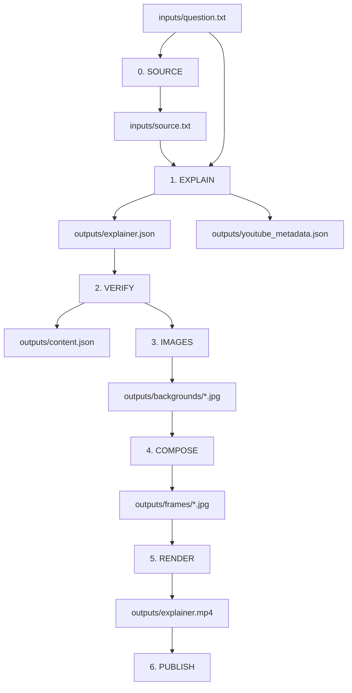

# Know the Big Picture — Product and Technical Design

This document is the source of truth for the product, editorial model, data
contracts, and pipeline.

## 1. Product

Know the Big Picture is an automated short-form educational video engine. It answers
one compelling question in everyday language for people with no technical
background, across ages, professions, and levels of English fluency.

**Brand promise:** The internet explains what. We explain why and how.

The product favors evergreen understanding over disposable updates. It may
explain current events, but it explains their causes, mechanisms, participants,
and importance rather than explaining events as a fixed sequence.

### Principles

- Start with the viewer's exact question.
- Be simple, never simplistic or childish.
- Explain prerequisites before using them.
- Prefer causal and mechanical understanding over trivia.
- Put one major idea on each slide.
- Select only the relevant what, why, how, who, and when.
- Ground every factual slide in the source packet.
- Use visuals to teach, not merely decorate.
- Keep expensive stages cached and runs resumable.
- Do not classify content into predefined categories.

## 2. Editorial model

Every video begins with a `question` slide. The generator then chooses the
smallest useful sequence from these roles:

| Role | Purpose |
|---|---|
| `question` | Exact input question; mandatory and first |
| `definition` | What the subject is |
| `purpose` | Why it exists or matters |
| `mechanism` | How a process or cause works |
| `component` | One important part of a system |
| `example` | A concrete real-world case |
| `comparison` | An accurate analogy or contrast |
| `context` | Relevant who, when, or background |
| `misconception` | Correction of a likely misunderstanding |
| `surprising_fact` | A memorable, supported closing insight |

Only `question` has a required count and position. Other roles may repeat or be
omitted. History and dates appear only when they improve the explanation.

### Question strategy

- **How:** reveal the mechanism in intelligible steps.
- **Why:** explain causes, incentives, purpose, and consequences.
- **What:** define, distinguish, and demonstrate.
- **Who:** explain an actor's role and importance.
- **When:** include timing only when it changes understanding.

The model is not required to answer every question word.

## 3. Pipeline



Stage 0 is skipped when `source.txt` already exists. `--dry-run` creates a local
placeholder source when needed and mocks the paid content and image calls while
exercising verification, composition, timing, and video rendering. `--lite`
stops after content generation.

## 4. Job contract

```text
jobs/<numeric-id>/
  job.json
  inputs/
    question.txt
    source.txt
  outputs/
    explainer.json
    content.json
    youtube_metadata.json
    backgrounds/<slide-id>.jpg
    frames/<slide-id>.jpg
    render_plan.json
    explainer.mp4
    youtube_upload.json
    instagram_upload.json
  logs/
  status.json
```

`question.txt` is the primary author input. `source.txt` is optional. When it is
missing, Stage 0 creates a stable factual source packet during a real run or a
clearly synthetic placeholder packet during an offline dry run. Questions
involving mutable facts require appropriately current external material in real
runs; the prompt must not guess.

## 5. Canonical schema

`explainer.json` contains facts and presentation order, but no timing:

```json
{
  "schema_version": 1,
  "explainer": {
    "id": "4",
    "question": "How does GPS know your location?",
    "question_source": "author",
    "subject": "GPS positioning",
    "subject_source": "llm",
    "audience": "general_non_technical_audience",
    "summary": "GPS calculates position from the travel time of satellite signals."
  },
  "slides": [
    {
      "id": 1,
      "role": "question",
      "heading": "How does GPS know your location?",
      "explanation": "Your phone measures signals from clocks orbiting Earth.",
      "source_quotes": ["verbatim support from source.txt"],
      "image_prompt": "an educational visualization...",
      "priority": 1
    }
  ]
}
```

Slide IDs start at 1 and express presentation order. `priority` controls optional
trimming: 1 is essential, 2 is useful, and 3 is safest to remove.

## 6. Prompt contract

The explainer prompt is the core editorial specification. It must:

- preserve the exact question on slide one;
- reduce the answer to a plain cause-and-effect chain before creating slides;
- make every slide add one distinct link that follows naturally from the last;
- favor a complete, memorable explanation over broad factual coverage;
- choose relevant question dimensions rather than apply a fixed formula;
- teach prerequisites before mechanisms;
- translate specialist names into their everyday function;
- omit scientific names unless the name is central or necessary for accuracy;
- use short conversational headings and explanations;
- include concrete examples and accurate analogies when helpful;
- address a central misconception when helpful;
- reject duplicate definition or summary slides;
- use examples, misconceptions, and surprising facts only after the core answer
  is complete;
- end with the final useful step, result, or takeaway;
- require verbatim source support and instructional image prompts;
- return JSON only.

The source-packet prompt creates complete quotable statements sufficient for
five to seven slides. It rejects unsupported precision and identifies questions
that require fresh external sources.

## 7. Verification

Stage 2 mechanically enforces:

- 5–6 slides by default;
- exactly one `question` role, first;
- exact match between the central question and first heading;
- sequential slide IDs;
- valid roles and unique headings;
- heading and explanation word limits;
- at least one source quotation per slide;
- every quotation found in sanitized `source.txt`;
- a non-empty instructional image prompt.

Teaching quality, relevance, terminology, and causal coherence are primarily
prompt responsibilities. Mechanical checks are deliberately limited to claims
the code can prove.

## 8. Visual system

The default style is `educational_documentary`. Prompts favor:

- one obvious subject or action;
- very few objects;
- clean real-world scenes or simple physical metaphors;
- plain backgrounds and generous negative space;
- immediately understandable compositions.

Complex diagrams, split screens, multi-panel layouts, arrows, equations, and
floating icons are avoided. Generated images contain no labels or readable text.
Composition uses a solid black text panel with high-contrast white writing. It
adds the short heading, one sentence of explanation, and the “Know the Big Picture”
signature. Role labels are hidden by default to reduce clutter.

## 9. Timing and trimming

Timing derives from the combined heading and explanation word count. A reading
floor keeps dense concepts legible. `surprising_fact` receives a small landing
bonus.

When content exceeds the configured maximum, the render plan removes the
highest-numbered optional priorities first. Priority-1 slides remain. Remaining
durations scale into the configured 30–60 second range, and the result is written
to `render_plan.json`.

## 10. Metadata and publishing

The explanation call also creates an evergreen, question-led YouTube title,
description, and subject-specific tags. Generic news and event-history framing are
not used. The default YouTube category is Education (`27`).

YouTube uploads privately by default. Instagram defaults to `container_only`;
`live` is an explicit configuration choice. Publishing is independently gated
by job configuration and command-line flags.

## 11. Configuration

`job.json` contains optional overrides:

| Section | Main controls |
|---|---|
| `explainer` | question, subject, audience |
| `parse` | model, slide range, word limits, verification behavior |
| `images` | model, size, visual vibe |
| `compose` | backdrop, explanation and role visibility |
| `video` | duration, motion, audio, outro |
| `youtube` | enablement, privacy, upload metadata |
| `instagram` | enablement, mode, caption, URL |

There is intentionally no category field or category-specific pipeline.

## 12. Operations

The Python package is `knowthebigpicture`. Local commands run with
`python -m knowthebigpicture.<command>`. Project environment variables use `KBP_`.
Remote storage defaults to `gdrive:knowthebigpicture`, and GitHub Actions uses
`.github/workflows/run-knowthebigpicture.yml`.

Heavy outputs stay in job folders and remote storage. Prompts, the job template,
brand styles, code, and documentation remain version controlled.
